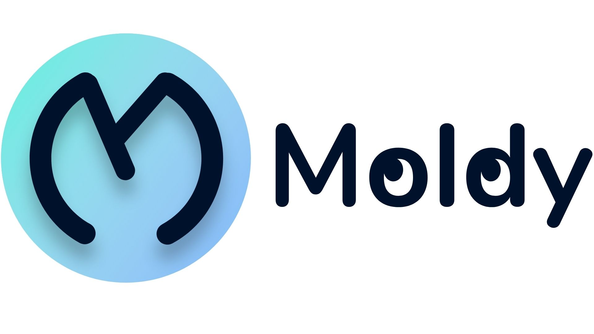

# 🧰 Moldy: the best tool to start your project



You don't know how to start your project ... you want to help other people know your tool or language. Use Moldy! the best helper to start your project

# Details about Moldy

The Moldy history and philosopy is here:

1. Spanish [here](./docs/HISTORY_es.md)
2. English [here](./docs/HISTORY_en.md)

For any other transtation make a pull request the spanish history is the original

## 🧐 Contribute
1. Install Golang
2. Install Git
3. Give me a star ⭐
4. Make a Fork
5. Clone the repository using git 
   ```
   git clone https://github.com/YOUR_USER/CLI.git
   ```
6. Install the dependencies with: 
   ```
   go mod tidy
   ```
7. Run the CLI with:
   ```
   go run main.go --help
   ``` 
8. Make a new branch: 
   ```
   git branch -M new-feat 
   ```
9. Commit your changes with the guide [CONVENTIONAL COMMITS](https://www.conventionalcommits.org/en/v1.0.0/).

10. Make a pull request describing the new feature and if pass the tests we accept your pull request or if not pass, will explain why.

# Authors

1. @junix7 [here](https://linktr.ee/junix) Web Developer
2. @TeoDev1611 [here](https://github.com/TeoDev1611) CLI, Documentation and Founder Developer
3. @NikolaM-Dev [here](https://github.com/NikolaM-Dev) Icon Desing

# Social media

Moldy is on the following social networks

1. [Twitter](https://twitter.com/Moldy-Community)
2. [Discord](https://discord.gg/FgjGwBd99a)
3. [Github](https://github.com/Moldy-Community)


---

Made with ❤️ in Ecuador
